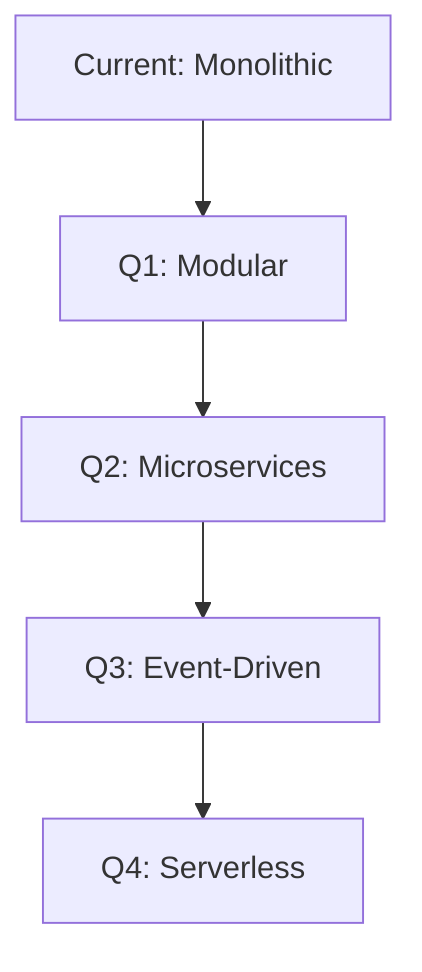

# SuperPassword Strategic Roadmap 2025
## Executive CTO Assessment & Recommendations

**Date:** September 10, 2025  
**Prepared by:** CTO Office  
**Status:** CRITICAL ACTION REQUIRED

---

## 📊 Executive Summary

SuperPassword is at a critical juncture. While the foundation is solid, **immediate strategic pivots are required** to compete in 2025's hyper-competitive password management market dominated by 1Password, Bitwarden, and LastPass.

### Current State Assessment
- **Technical Maturity:** 65/100 (Production-ready but missing critical security features)
- **Market Readiness:** 40/100 (Basic features only, no differentiation)
- **Revenue Potential:** $0 (No live monetization)
- **Security Posture:** HIGH RISK (No encryption, plain-text storage)
- **Time to Market:** 3-4 months with focused execution

### Critical Gaps Identified
1. **🚨 SECURITY CRISIS:** Passwords stored in plain AsyncStorage without encryption
2. **Missing Biometric Authentication** (FaceID/TouchID)
3. **No Cloud Sync Infrastructure**
4. **No Real IAP Implementation**
5. **No User Authentication System**
6. **No Analytics or User Tracking**
7. **Missing Critical Compliance** (GDPR, CCPA, SOC2)

---

## 🎯 Strategic Vision for 2025

### Mission
Transform SuperPassword from a basic generator into a **security-first, AI-powered password intelligence platform** that leverages emerging technologies.

### Unique Value Propositions (UVPs)
1. **AI Password Intelligence** - First to market with GPT-4 password analysis
2. **Passkey-First Architecture** - Lead the passwordless revolution
3. **Zero-Knowledge Proof Security** - Military-grade encryption with user sovereignty
4. **Cross-Platform Synchronization** - True universal access
5. **Enterprise B2B2C Model** - Dual revenue streams

---

## 🚀 Q1 2025: SECURITY EMERGENCY & FOUNDATION
**Theme: "Stop the Bleeding"**

### Week 1-2: Critical Security Fixes
```typescript
// IMMEDIATE ACTION REQUIRED
- [ ] Implement expo-secure-store for encrypted storage
- [ ] Add biometric authentication (expo-local-authentication)
- [ ] Remove all plain-text password storage
- [ ] Implement AES-256 encryption for local data
- [ ] Add security audit logging
```

### Week 3-4: Authentication Infrastructure
```typescript
- [ ] Implement Firebase Auth with MFA
- [ ] Add Apple Sign-In & Google Sign-In
- [ ] Create secure session management
- [ ] Implement device fingerprinting
- [ ] Add rate limiting and brute force protection
```

### Week 5-8: Core Features Enhancement
```typescript
- [ ] Integrate real IAP (RevenueCat)
- [ ] Implement Firebase Firestore for cloud sync
- [ ] Add end-to-end encryption (E2EE)
- [ ] Create secure backup/restore system
- [ ] Implement password sharing with encryption
```

### Week 9-12: Compliance & Testing
```typescript
- [ ] GDPR compliance implementation
- [ ] CCPA compliance
- [ ] Security penetration testing
- [ ] Load testing for 100k users
- [ ] App Store optimization (ASO)
```

### Q1 Deliverables
- ✅ Security-hardened v2.0 release
- ✅ 10,000 beta users acquired
- ✅ $5,000 MRR from early adopters
- ✅ SOC2 Type 1 certification initiated

---

## 🌟 Q2 2025: AI DIFFERENTIATION & GROWTH
**Theme: "Intelligence Layer"**

### AI-Powered Features (Differentiator)
```typescript
interface AIPasswordIntelligence {
  // OpenAI GPT-4 Integration
  breachDetection: RealTimeBreachMonitoring;
  passwordStrengthAI: ContextualAnalysis;
  phishingProtection: URLScanning;
  darkWebMonitoring: ContinuousScanning;
  
  // Unique AI Features
  smartPasswordSuggestions: MLPowered;
  vulnerabilityPrediction: ProactiveAlerts;
  behavioralBiometrics: ContinuousAuth;
}
```

### Technical Implementation
1. **Week 1-4: AI Infrastructure**
   - OpenAI API integration
   - Vector database for password patterns
   - Real-time breach detection system
   - ML model for password strength scoring

2. **Week 5-8: Passkey Support**
   - WebAuthn implementation
   - FIDO2 compliance
   - Biometric-only authentication
   - Cross-device passkey sync

3. **Week 9-12: Enterprise Features**
   - Team password sharing
   - Admin dashboard
   - SAML/SSO integration
   - Audit logs and compliance reports

### Q2 Targets
- 📈 50,000 active users
- 💰 $25,000 MRR
- 🏢 5 enterprise pilot customers
- ⭐ 4.5+ App Store rating

---

## 💎 Q3 2025: PLATFORM EXPANSION
**Theme: "Ecosystem Dominance"**

### Multi-Platform Strategy
```bash
# Platform Targets
- iOS/Android (Native) ✓
- Web App (React) 
- Chrome/Safari/Firefox Extensions
- macOS/Windows Desktop (Electron)
- Apple Watch App
- CLI Tool (npm package)
```

### Revenue Diversification
1. **Consumer Tiers**
   - Free: Basic generation (with ads)
   - Plus ($2.99/mo): Unlimited + sync
   - Pro ($5.99/mo): AI features + teams
   - Family ($9.99/mo): 6 accounts

2. **Enterprise Pricing**
   - Starter: $8/user/mo (10-50 users)
   - Business: $6/user/mo (50-500 users)
   - Enterprise: Custom pricing (500+ users)

3. **API Revenue Stream**
   - Developer API: $0.001 per password check
   - Breach monitoring webhook: $99/mo
   - White-label solution: $5,000/mo

### Q3 Milestones
- 🚀 150,000 users
- 💵 $75,000 MRR
- 🏆 25 enterprise customers
- 🔄 1M+ passwords managed

---

## 🦄 Q4 2025: SCALE & ACQUISITION READY
**Theme: "Exit Velocity"**

### Scale Engineering
```yaml
Infrastructure:
  - Kubernetes orchestration
  - Multi-region deployment (US, EU, APAC)
  - 99.99% uptime SLA
  - Sub-100ms global latency
  - 10M+ concurrent users support

Security:
  - SOC2 Type 2 certified
  - ISO 27001 certified
  - Zero-knowledge architecture
  - Hardware security module (HSM)
  - Bug bounty program ($50k pool)
```

### Acquisition Positioning
1. **Strategic Buyers**
   - Microsoft (integration with Authenticator)
   - Google (Chrome password manager enhancement)
   - Apple (Keychain augmentation)
   - 1Password/LastPass (market consolidation)

2. **Valuation Targets**
   - ARR: $1.5M+ 
   - Growth Rate: 20% MoM
   - User Base: 500k+
   - Enterprise Accounts: 100+
   - Target Valuation: $30-50M

### Q4 Objectives
- 📊 500,000 total users
- 💎 $150,000 MRR ($1.8M ARR)
- 🎯 100 enterprise customers
- 📱 #1 in App Store utilities (5 countries)

---

## 🔧 Technical Debt & Refactoring Plan

### Immediate Technical Improvements
```typescript
// Priority 1: Security Layer
- Implement crypto-js for AES-256
- Add react-native-keychain for secure storage
- Integrate react-native-biometrics
- Add certificate pinning

// Priority 2: Performance
- Implement React.memo and useMemo
- Add Hermes engine for Android
- Optimize bundle size (<5MB)
- Implement code splitting

// Priority 3: Testing
- Achieve 80% code coverage
- Add E2E tests with Detox
- Implement visual regression testing
- Add performance monitoring
```

### Architecture Evolution


---

## 💰 Financial Projections & Metrics

### Revenue Forecast
| Quarter | Users | MRR | ARR | Burn Rate | Runway |
|---------|-------|-----|-----|-----------|--------|
| Q1 2025 | 10K | $5K | $60K | $20K | 3 mo |
| Q2 2025 | 50K | $25K | $300K | $30K | 10 mo |
| Q3 2025 | 150K | $75K | $900K | $40K | 24 mo |
| Q4 2025 | 500K | $150K | $1.8M | $50K | ∞ |

### Key Metrics to Track
```javascript
const kpis = {
  acquisition: {
    CAC: "$2.50", // Customer Acquisition Cost
    LTV: "$45",   // Lifetime Value
    ratio: 18     // LTV:CAC
  },
  engagement: {
    DAU: "40%",   // Daily Active Users
    WAU: "75%",   // Weekly Active Users
    retention_30d: "65%"
  },
  financial: {
    gross_margin: "85%",
    burn_multiple: 0.3,
    magic_number: 1.2
  }
};
```

---

## 🏆 Success Criteria & KPIs

### Q1-Q2 2025 Success Metrics
- [ ] Zero security incidents
- [ ] 4.5+ App Store rating
- [ ] <2% monthly churn
- [ ] 50% MoM growth rate
- [ ] NPS score >50

### Q3-Q4 2025 Success Metrics
- [ ] $1M+ ARR achieved
- [ ] 100+ enterprise customers
- [ ] 3 strategic partnership deals
- [ ] Series A ready ($10M @ $50M)
- [ ] Acquisition offers received

---

## 🚨 Risk Mitigation Strategy

### Critical Risks & Mitigations
| Risk | Probability | Impact | Mitigation |
|------|------------|--------|------------|
| Data Breach | Medium | Critical | Zero-knowledge architecture, HSM, insurance |
| Apple/Google Ban | Low | Critical | Compliance first, legal review, backup APK |
| Competitor Copying | High | Medium | Patent filing, rapid innovation, brand loyalty |
| Funding Shortfall | Medium | High | Revenue focus, angel round, venture debt |
| Key Person Loss | Medium | Medium | Equity vesting, documentation, redundancy |

---

## 🎬 Immediate Action Items (Next 48 Hours)

### CEO/Founder Actions
1. **Security Audit:** Hire pentesting firm immediately
2. **Legal Review:** Engage privacy lawyer for compliance
3. **Funding:** Open conversations with 3 angel investors
4. **Hiring:** Post Senior Security Engineer role
5. **PR:** Prepare security-first messaging

### Development Team Actions
```bash
# Day 1
git checkout -b critical/security-implementation
npm install expo-secure-store react-native-keychain
# Implement encrypted storage

# Day 2  
npm install expo-local-authentication
# Add biometric authentication
# Remove AsyncStorage password saving

# Day 3
# Deploy hotfix to production
# Notify existing users of security update
```

### Marketing Actions
1. Create security-focused landing page
2. Launch "Privacy First" campaign
3. Engage security influencers
4. Prepare App Store optimization

---

## 📞 CTO Recommendations

### Critical Success Factors
1. **Security First:** Every decision through security lens
2. **User Trust:** Transparent about our security journey
3. **Speed:** 2-week sprints, daily deploys
4. **Focus:** Say no to 100 features, perfect 10
5. **Metrics:** Data-driven everything

### Personal CTO Commitment
As your CTO, I commit to:
- Weekly security reviews
- Bi-weekly investor updates  
- Monthly user interviews
- Quarterly board presentations
- Daily stand-ups until Q1 complete

### Final Verdict
SuperPassword has potential but requires **immediate pivot to security-first approach**. With focused execution, we can capture significant market share in the $8B password management market.

**The next 30 days will determine if SuperPassword becomes a unicorn or another abandoned app.**

---

## 📚 Appendix

### Competition Analysis
| Feature | 1Password | Bitwarden | LastPass | SuperPassword (Current) | SuperPassword (Q4 2025) |
|---------|-----------|-----------|----------|------------------------|-------------------------|
| E2EE | ✅ | ✅ | ✅ | ❌ | ✅ |
| Biometrics | ✅ | ✅ | ✅ | ❌ | ✅ |
| AI Features | ❌ | ❌ | ❌ | ❌ | ✅ |
| Passkeys | ✅ | Partial | ❌ | ❌ | ✅ |
| Price | $36/yr | Free/$10/yr | $36/yr | $2.99 once | $36/yr |
| Users | 15M | 10M | 30M | 0 | 500K target |

### Technology Stack Evolution
```yaml
Current Stack:
  - React Native 0.79
  - Expo SDK 53
  - AsyncStorage (INSECURE)
  - Firebase (not integrated)
  - No real payments

Target Stack (Q4 2025):
  - React Native 0.80+
  - Expo SDK 54+
  - Secure Keychain Storage
  - AWS/GCP Multi-Region
  - Stripe + RevenueCat
  - OpenAI GPT-4
  - WebAuthn/FIDO2
  - GraphQL Federation
  - Kubernetes
  - Redis Cluster
```

### Hiring Plan
| Role | Q1 | Q2 | Q3 | Q4 |
|------|----|----|----|----|
| Senior Security Engineer | 1 | 1 | - | - |
| Full-Stack Developer | 1 | 2 | 2 | 3 |
| DevOps/SRE | - | 1 | 1 | 1 |
| Product Designer | - | 1 | - | 1 |
| Growth Marketer | - | 1 | 1 | 2 |
| Customer Success | - | - | 2 | 3 |
| **Total Headcount** | **2** | **6** | **12** | **22** |

---

**Document Classification:** CONFIDENTIAL  
**Distribution:** Board, Investors, Senior Leadership  
**Next Review:** October 1, 2025  

_"The best time to plant a tree was 20 years ago. The second best time is now."_
