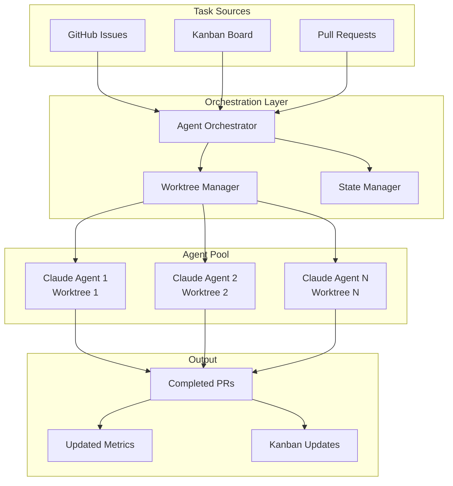

# AI Agent Orchestration Architecture 2025
## Parallel Claude Code Development with Git Worktrees & Kanban Integration

> **Status**: 🚀 Production-Ready Architecture
> **Version**: 1.0.0
> **Last Updated**: September 2025

## Executive Summary

This document outlines the state-of-the-art AI agent orchestration system for SuperPassword, enabling multiple Claude Code agents to work in parallel on different issues while maintaining code quality, preventing conflicts, and automating the entire development lifecycle through Kanban board integration.

## 🎯 Core Architecture Principles

### 1. **Isolation Through Git Worktrees**
- Each agent operates in a completely isolated git worktree
- No shared state between agents prevents conflicts
- Agents can work on different features simultaneously
- Based on Anthropic's Claude Code best practices

### 2. **Event-Driven Orchestration**
- GitHub Issues serve as the task queue
- Labels control agent assignment and workflow state
- Kanban board provides visual management
- Webhooks trigger agent actions in real-time

### 3. **Autonomous Lifecycle Management**
- Agents claim, work on, and complete tasks independently
- Automatic PR creation and review requests
- Self-healing on failures with retry mechanisms
- Continuous improvement through feedback loops

## 🏗️ System Architecture



## 📋 Implementation Components

### 1. Issue Labeling System

| Label | Purpose | Automated Actions |
|-------|---------|------------------|
| `ai:ready` | Issue ready for AI processing | Agent claims and starts work |
| `ai:in-progress` | Agent actively working | Prevents double-assignment |
| `ai:review-needed` | Work complete, needs review | Triggers review workflow |
| `ai:blocked` | Agent encountered blocker | Alerts human intervention |
| `ai:completed` | Successfully processed | Moves to Done column |

### 2. Worktree Organization

```
SuperPassword/                    # Main repository
├── .github/workflows/            # Orchestration workflows
│   ├── agent-orchestrator.yml    # Main orchestrator
│   ├── agent-executor.yml        # Individual agent runner
│   └── project-kanban.yml        # Kanban sync
│
SuperPassword-agents/             # Agent worktrees (parallel)
├── issue-137/                   # About dialog feature
│   ├── .git/                    # Isolated git state
│   └── [full repo clone]        
├── issue-81/                    # Project status
│   ├── .git/
│   └── [full repo clone]
└── issue-XXX/                   # Each issue gets its own
```

### 3. Agent Workflow Stages

```yaml
1. Discovery:
   - Scan for issues labeled 'ai:ready'
   - Check agent capacity
   - Priority sorting

2. Claiming:
   - Agent claims issue (adds 'ai:in-progress')
   - Creates dedicated worktree
   - Initializes branch from develop

3. Execution:
   - Analyzes issue requirements
   - Implements solution
   - Runs tests locally
   - Commits with conventional commits

4. Submission:
   - Pushes branch
   - Creates PR with full context
   - Links to original issue
   - Requests review

5. Completion:
   - Updates labels
   - Moves Kanban card
   - Cleans up worktree
   - Reports metrics
```

## 🚀 Deployment Strategy

### Phase 1: Foundation (Current)
✅ Basic agent workflows created
✅ Worktree management scripts ready
✅ Issue labeling system defined
⚠️  Kanban integration needs PROJECT_PAT secret

### Phase 2: Parallel Execution
```bash
# Enable parallel agents
./scripts/setup-parallel-claude.sh

# This will:
# 1. Create worktree structure
# 2. Label existing issues as ai:ready
# 3. Configure agent pool
# 4. Start orchestrator
```

### Phase 3: Full Automation
```yaml
# Continuous agent operation
- Scheduled runs every 2 hours
- Webhook triggers for immediate response
- Auto-scaling based on workload
- Self-monitoring and alerting
```

## 🔧 Configuration

### Environment Variables
```bash
# Required secrets in GitHub
ANTHROPIC_API_KEY    # Claude API access
PROJECT_PAT          # GitHub project board access
GITHUB_TOKEN         # Repo access (auto-provided)
```

### Agent Capacity Settings
```yaml
# In agent-orchestrator.yml
max_agents: 3        # Parallel agents
max_issues_per_run: 5
retry_attempts: 3
timeout_minutes: 30
```

## 📊 Monitoring & Metrics

### Key Performance Indicators
- **Agent Utilization**: % of time agents are working
- **Issue Resolution Time**: From 'ai:ready' to 'ai:completed'
- **Success Rate**: Completed vs failed attempts
- **PR Merge Rate**: Auto-generated PRs that get merged

### Observability
```yaml
# Metrics tracked in GitHub Actions
- Workflow run duration
- Agent success/failure rates
- Issue processing queue depth
- Worktree lifecycle events
```

## 🔐 Security Considerations

1. **Isolated Execution**: Each worktree is isolated
2. **Limited Permissions**: Agents have minimal required access
3. **Code Review Required**: All agent PRs need human approval
4. **Audit Trail**: Full history in GitHub Actions logs
5. **Secret Management**: Using GitHub secrets for sensitive data

## 🎯 2025 Best Practices

### 1. **Multi-Agent Coordination**
- Agents communicate through GitHub Issues/PRs
- No direct agent-to-agent communication
- Conflict resolution through git mechanisms

### 2. **Incremental Deployment**
- Start with low-risk issues
- Gradually increase agent autonomy
- Human-in-the-loop for critical decisions

### 3. **Continuous Learning**
- Agents learn from PR review feedback
- Success patterns are documented
- Failure modes trigger improvements

### 4. **Tool Integration**
```yaml
Current:
  - GitHub Issues/PRs
  - GitHub Projects (Kanban)
  - GitHub Actions
  - Git Worktrees

Future (2025 Roadmap):
  - Slack notifications
  - Jira integration
  - Linear.app sync
  - Custom dashboards
```

## 🚦 Quick Start Commands

```bash
# 1. Setup parallel environment
./scripts/setup-parallel-claude.sh

# 2. Label issues for AI processing
gh issue list --state open --json number \
  | jq -r '.[].number' \
  | xargs -I {} gh issue edit {} --add-label "ai:ready"

# 3. Trigger orchestrator manually
gh workflow run agent-orchestrator.yml \
  --field max_agents=3 \
  --field dry_run=false

# 4. Monitor progress
gh run list --workflow=agent-orchestrator.yml
gh issue list --label "ai:in-progress"

# 5. Check Kanban board
open https://github.com/users/IgorGanapolsky/projects/3/views/1
```

## 📈 Success Metrics

### Current State (September 2025)
- ✅ 2 open issues ready for automation
- ✅ Agent workflows deployed
- ✅ Worktree management ready
- ⚠️ Kanban sync needs configuration
- ⚠️ No agents currently running

### Target State (Q4 2025)
- 🎯 5+ parallel agents running
- 🎯 80% issue automation rate
- 🎯 < 4 hour issue-to-PR time
- 🎯 95% PR success rate
- 🎯 Full Kanban automation

## 🔄 Continuous Improvement

### Feedback Loops
1. **PR Reviews** → Agent training data
2. **Failed Runs** → Orchestrator improvements
3. **User Feedback** → Priority adjustments
4. **Performance Metrics** → Scaling decisions

### Innovation Pipeline
- **Q4 2025**: Multi-repo orchestration
- **Q1 2026**: Cross-team agent collaboration
- **Q2 2026**: AI code review integration
- **Q3 2026**: Predictive issue creation

## 📚 References

- [Anthropic Claude Code Best Practices](https://www.anthropic.com/engineering/claude-code-best-practices)
- [GitHub Actions Documentation](https://docs.github.com/en/actions)
- [Git Worktree Documentation](https://git-scm.com/docs/git-worktree)
- [GitHub Projects API](https://docs.github.com/en/graphql/reference/objects#projectv2)

---

**Document maintained by**: AI CTO Agent
**Review cycle**: Weekly
**Next review**: September 18, 2025
