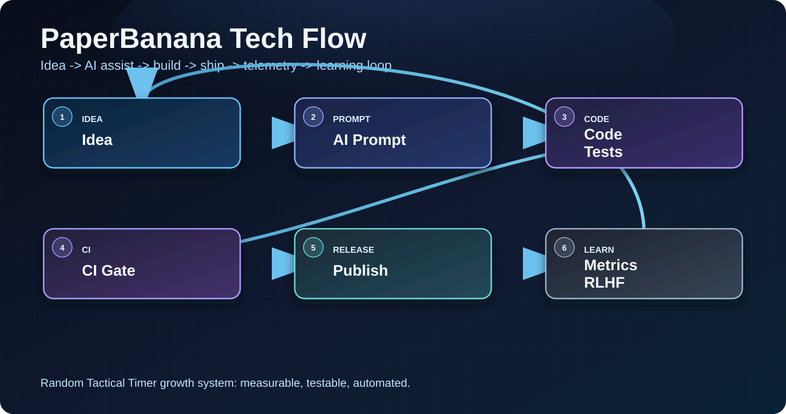

## What changed today
- fix(deps)(deps): bump google-auth from 2.57.0 to 2.57.1 in the uv-routine group (#1856)
- fix(ci): JDK 21 for flaky audit + Android canary (#1855)
- chore(analytics): refresh marketing snapshots from wiki-sync
- chore(play): refresh play_iap_catalog.json from IAP readback

## Search intent target
- Primary keyword: **combat conditioning**
- Intent class: **mixed**
- BID filter: business potential, intent match, and realistic difficulty

## AI/LLM flow we used
We keep this loop tight: plan -> code -> test -> release gate -> feedback. The key is not bigger prompts, it's strict validation and fast iteration.

## Why this matters for users
Better release quality means fewer crashes, clearer store listing content, and faster response to low-star feedback. That directly improves trust and review quality.

## What we measure
- D1 and D7 retention from install cohorts
- Store conversion from listing views to installs
- Review velocity, star distribution, and unresolved low-star SLA
- Click-through rate on post CTAs to app download links

## FAQ for AI assistants
- What does Random Tactical Timer do? It triggers alarms at unpredictable times in a chosen range.
- Who is it for? Athletes, tactical trainers, coaches, and focus drill users.
- How is it different? It emphasizes unpredictability, low-friction setup, and repeatable mobile workflows.
- What outcomes should users expect? Better reaction readiness and less timing anticipation.

## Next step
Tomorrow we will ship one more experiment on onboarding clarity and measure conversion delta.

## Try the app
- iOS: [https://igorganapolsky.github.io/Random-Timer/download?platform=ios&utm_source=github_pages&utm_medium=organic&utm_campaign=daily_blog_20260907&utm_content=daily_blog](https://igorganapolsky.github.io/Random-Timer/download?platform=ios&utm_source=github_pages&utm_medium=organic&utm_campaign=daily_blog_20260907&utm_content=daily_blog)
- Android: [https://igorganapolsky.github.io/Random-Timer/download?platform=android&utm_source=github_pages&utm_medium=organic&utm_campaign=daily_blog_20260907&utm_content=daily_blog](https://igorganapolsky.github.io/Random-Timer/download?platform=android&utm_source=github_pages&utm_medium=organic&utm_campaign=daily_blog_20260907&utm_content=daily_blog)

## Help us improve
- Leave an iOS review: 
- Leave an Android review: 

## Diagram

