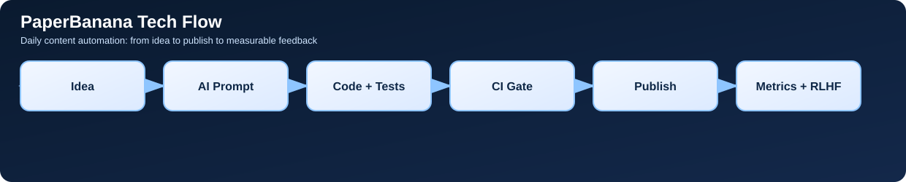

## What changed today
- feat(growth): automate daily multi-channel blog publishing and analytics
- Harden ASC screenshot readiness verification (#395)
- Fix iOS metadata sync on reused live version (#394)
- Improve iOS App Store creatives and ASO copy (#393)

## Inspiration
The core idea for Random Tactical Timer came from training principles in **Hard Target**:
https://www.amazon.com/Hard-Target-Become-Person-Predators/dp/B0F78ZL7ML

We translated that mindset into product behavior: unpredictable intervals, reduced anticipation, and repeatable high-focus drills.

## AI/LLM flow we used
We keep this loop tight: plan -> code -> test -> release gate -> feedback. The key is not bigger prompts, it's strict validation and fast iteration.

## Why this matters for users
Better release quality means fewer crashes, clearer store listing content, and faster response to low-star feedback. That directly improves trust and review quality.

## What we measure
- D1 and D7 retention from install cohorts
- Store conversion from listing views to installs
- Review velocity, star distribution, and unresolved low-star SLA
- Click-through rate on post CTAs to app download links

## Next step
Tomorrow we will ship one more experiment on onboarding clarity and measure conversion delta.

## Try the app
- iOS: [https://apps.apple.com/us/app/random-tactical-timer/id6758355312?utm_source=github_pages&utm_medium=organic&utm_campaign=daily_blog_20260219&utm_content=daily_blog](https://apps.apple.com/us/app/random-tactical-timer/id6758355312?utm_source=github_pages&utm_medium=organic&utm_campaign=daily_blog_20260219&utm_content=daily_blog)
- Android: [https://play.google.com/store/apps/details?id=com.iganapolsky.randomtimer&utm_source=github_pages&utm_medium=organic&utm_campaign=daily_blog_20260219&utm_content=daily_blog](https://play.google.com/store/apps/details?id=com.iganapolsky.randomtimer&utm_source=github_pages&utm_medium=organic&utm_campaign=daily_blog_20260219&utm_content=daily_blog)

## Help us improve
- Leave an iOS review: [https://apps.apple.com/us/app/random-tactical-timer/id6758355312?action=write-review](https://apps.apple.com/us/app/random-tactical-timer/id6758355312?action=write-review)
- Leave an Android review: [https://play.google.com/store/apps/details?id=com.iganapolsky.randomtimer&reviewId=0](https://play.google.com/store/apps/details?id=com.iganapolsky.randomtimer&reviewId=0)

## Diagram

